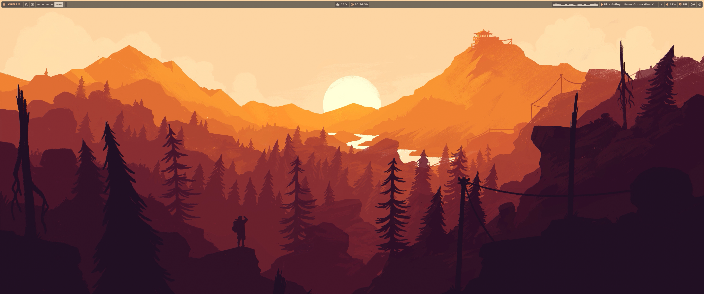
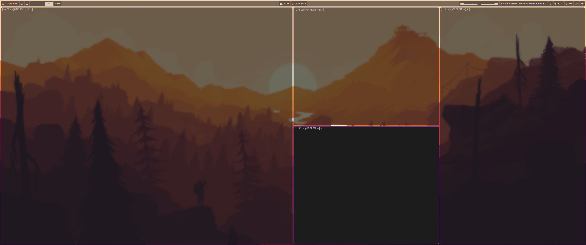
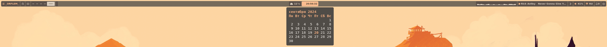
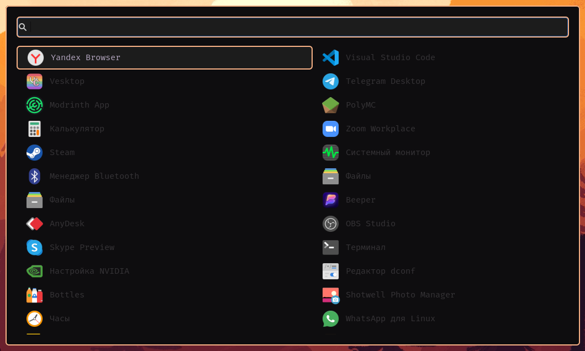
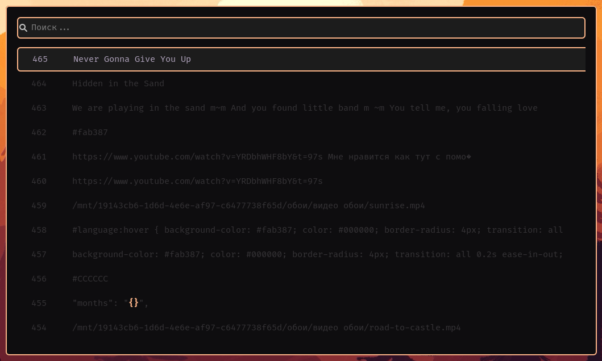
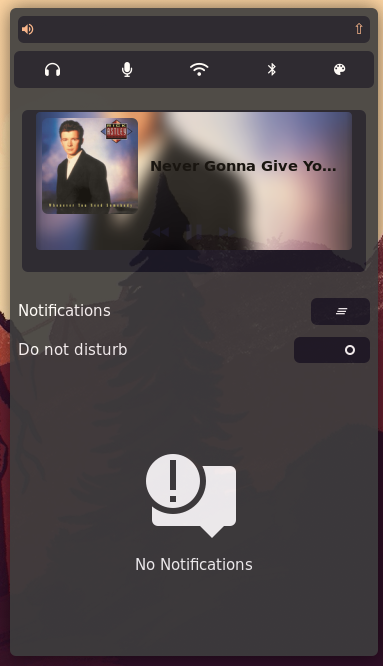
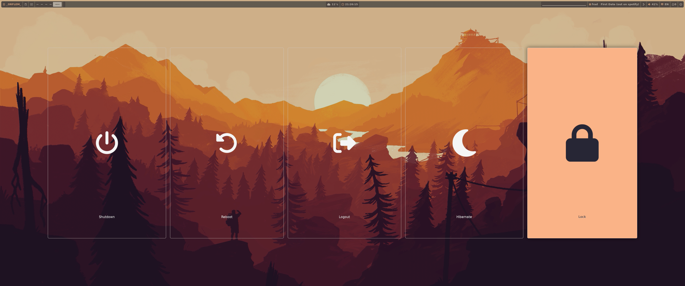

# Hyprland sunrise
   

        
   

## 💾 Обновление:

Добавленна поддержка широких мониторов (16:9)  
вы можете использвоать видео обои 16:9 на ултраширких мониторах (21:9) используя в waybar change_live_bgz и в hyprland exec-once = ... (zoom 0.43)  
добавлена смена тем  

##  📥 Установка
> [!ВАЖНО]
> Вам надо поставить: hyprbars, hyprspace, waybar, swaync, wlogout, wofi, blueman, playerctl, cava, mpvpaper, swaybg, NetworkManager-tui, chiphist, pulseaudio и два шрифта: fira code nerd и mononoki. Иначе полноыенно использовать конфигурацию hyprland не получится!

## 📄 Об проекте:

Данная конфигурация hyprland работает корректнно на ультрашироких мониторах (21:9)

## Выглядит:
  
  ### Р. стол:
   

        
   

   

        
   

  ### Панель управления:
   

        
   

  ### Меню:

   

        
   

   

        
   

  ### Центр упрваления и уведомлений:

   

        
   

  ### Выключение:

   

        
   

## 💾 Update:

added support wide monitors (16:9)  
if you have use wide (16:9) live wallpaper on ultrawide monitors (21:9) you have use in waybar change_live_bgz, in hyprland exec-once = ... (zoom 0.43)  
added support change themes  

##  📥 Installation
> [!IMPORTANT]
> You need install: hyprbars, hyprspace, waybar, swaync, wlogout, wofi, blueman, playerctl, cava, mpvpaper, swaybg, NetworkManager-tui, chiphist, pulseaudio and two fonts: fira code nerd and mononoki. Different, you won't be able to fully use this configuration!

## 📄 info:

This configuration correctly work on ultrawide monitors (21:9)

## how it look like:
  
  ### workspace:
   

        
   

   

        
   

  ### control panel:
   

        
   

  ### menu:

   

        
   

   

        
   

  ### swaync:

   

        
   

  ### wlogout:

   

        
   

## created by: `_ORFLEM_` | Сделано: `_ORFLEM_`
